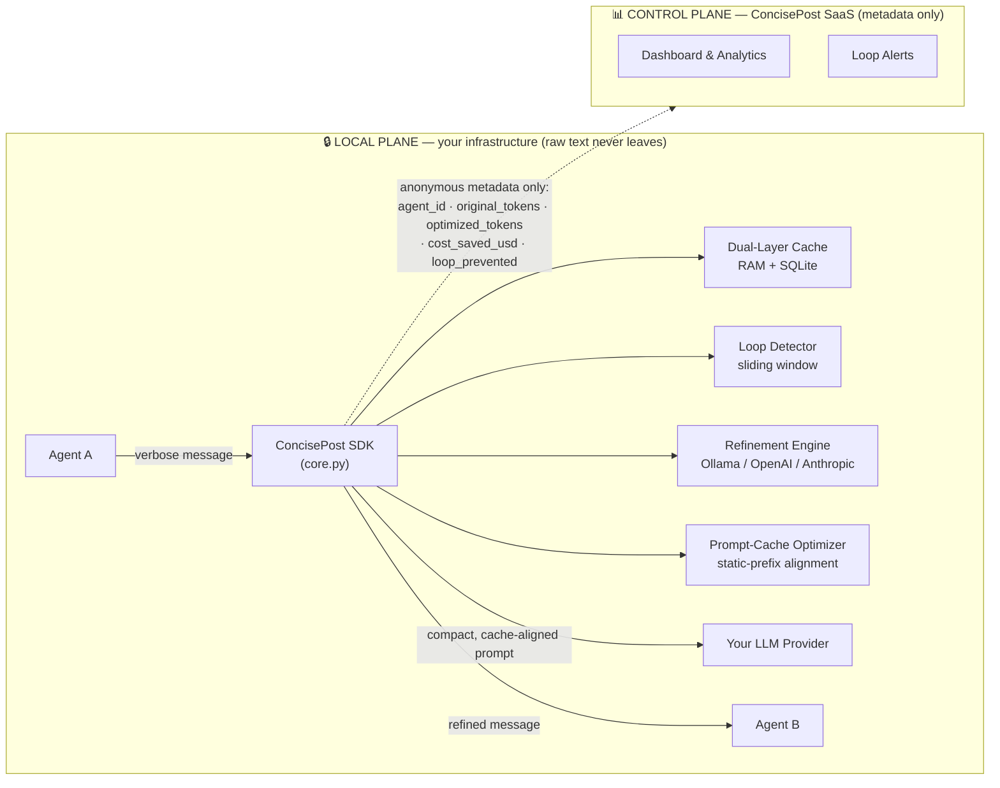

<div align="center">

# ⚡ ConcisePost

### Stop paying for what your agents *meant* to say.

**ConcisePost** is a local-first optimization layer for multi-agent systems. It compresses bloated inter-agent messages, aligns your prompts for native provider caching, and kills runaway loops **before** they drain your budget — all without adding latency, and without your raw prompts ever leaving your infrastructure.

[](https://pypi.org/project/concisepost/)
[](https://www.python.org/)
[](LICENSE)
[]()
[]()

[**Quick Start**](#-quick-start) · [**Architecture**](#-architecture-the-hybrid-split-plane) · [**Integrations**](#-integrations) · [**Pricing**](#-pricing) · [**Dashboard ROI**](#-the-dashboard-prove-the-roi)

</div>

---

## 💸 The Problem: Agent Token Inflation

Multi-agent frameworks are brilliant — and quietly bankrupting their operators.

Every time Agent A talks to Agent B, it pads its message with greetings, restated context, hedging, and politeness. Agent B does the same back. Multiply that across a crew of 5–10 agents running thousands of turns, and **you are billing premium frontier-model tokens to transmit "Hi team, I just wanted to quickly reach out and let you know that, as you may already know…"**

Three failure modes are eating your margin right now:

1. **Token Inflation** — verbose hand-offs inflate every prompt by 30–70%. You pay for the padding on *both* the input and the downstream context.
2. **Cache Misses** — most agent stacks shuffle system instructions, schemas, and tool definitions around between calls, so the provider's prompt cache never warms. You forfeit the **90% prompt-caching discount** you already qualified for.
3. **Loop Bankruptcies** — two agents get stuck politely repeating themselves. The token meter spins for hours. By the time anyone notices, the bill is four figures.

## ✅ The Solution

ConcisePost is a thin, local SDK that sits between your agents and your LLM and does three things on every message:

- **🗜️ Structural shortening** — rewrites the payload to be as short as possible while preserving *every* instruction, identifier, number, URL, and decision. A `QualityScorer` guards fidelity and **safely falls back to the original text** if a refinement would ever degrade meaning — so agents never break.
- **🎯 Prompt-cache alignment** — flattens your static context (system prompt + JSON/Pydantic schemas + tool definitions) into a single, byte-stable prefix at the top of the request, the exact precondition that triggers **OpenAI Context Caching** and **Anthropic Prompt Caching**.
- **🛑 Anti-loop insurance** — a sliding-window similarity tracker raises `InfiniteLoopException` the moment two agents start spinning, cutting the burn instantly. Think of it as an insurance policy against the runaway-loop bill that wipes out a month's API budget in a single overnight run.

And because results are cached in a **dual-layer (RAM + SQLite) store**, a repeated message returns in **sub-millisecond time at zero tokens** — even across process restarts.

> **The bottom line:** lower token bills, the caching discount you were leaving on the table, and a hard ceiling on loop disasters — with **0ms added latency** on cache hits.

---

## 🏛️ Architecture: The Hybrid Split-Plane

This is the part your security team will care about. ConcisePost runs on a **split-plane** model: a **Local Plane** that lives entirely inside your own infrastructure, and a thin **Control Plane** that only ever sees anonymous metrics.

**Your raw prompts, agent messages, and refined text never leave your server.** The only data that crosses the boundary is anonymous numeric metadata: token counts, dollars saved, and a loop-prevented flag.



| Crosses the boundary to our Control Plane | **Never** crosses the boundary |
| --- | --- |
| `agent_id` (a label you choose) | ❌ Raw prompt text |
| `original_tokens` / `optimized_tokens` | ❌ Refined message text |
| `cost_saved_usd` | ❌ System prompts, schemas, tool defs |
| `loop_prevented` (boolean) | ❌ Any user or business data |

You can run the Control Plane yourself, too — the FastAPI backend and PostgreSQL/Supabase schema are in [`server/`](server/), so air-gapped and on-prem deployments are first-class. The telemetry worker is **asynchronous, non-blocking, and time-boxed to 200 ms**, so reporting can never stall an agent.

---

## 🚀 Quick Start

### Install

```bash
pip install concisepost
```

### Optimize a message in 4 lines

```python
from concisepost.core import RefinementEngine

# Defaults to a local Ollama model; swap provider="openai" or "anthropic" anytime.
engine = RefinementEngine(provider="ollama", model="llama3")

result = engine.refine(
    agent_id="researcher",
    sender="researcher",
    receiver="writer",
    text="Hi team! I just wanted to quickly reach out and let you know that, "
         "as you may already know, the deployment for ORDER-API is basically "
         "scheduled for 2025-06-14 at 14:30 UTC. Thank you so much in advance!",
)

print(result.refined_text)
# -> "The deployment for ORDER-API is scheduled for 2025-06-14 at 14:30 UTC."

print(f"Saved {result.tokens_saved} tokens ({result.savings_pct()}%)")
print(f"Cached: {result.cached} | Latency: {result.latency_ms:.2f} ms")
```

Call `refine()` again with the same text and watch it return from cache in **~1 ms at 0 tokens**:

```python
again = engine.refine(agent_id="researcher", sender="researcher",
                      receiver="writer", text=result.original_text)
assert again.cached is True          # served from dual-layer cache
assert again.latency_ms < 5          # sub-millisecond, 0 tokens spent
```

### Catch a loop before it bankrupts you

```python
from concisepost.core import InfiniteLoopException

try:
    result = engine.refine(agent_id="planner", sender="A", receiver="B", text=msg)
except InfiniteLoopException as loop:
    # Budget protected. Break the cycle, reroute, or escalate to a human.
    print(f"🚨 Loop on {loop.channel} at {loop.similarity:.0%} similarity "
          f"after {loop.consecutive_similar} stalled turns.")
    reroute_or_halt()
```

---

## 🔌 Integrations

ConcisePost is framework-agnostic — anywhere a string moves between two agents, you can wrap it. Below are drop-in patterns for the two most popular stacks.

### LangGraph

Add ConcisePost as a node between your agents. It compresses the message in flight and raises on loops:

```python
from concisepost.core import RefinementEngine, InfiniteLoopException

engine = RefinementEngine(provider="openai", model="gpt-4o-mini")

def concisepost_node(state):
    last = state["messages"][-1]
    try:
        r = engine.refine(
            agent_id=state["sender"],
            sender=state["sender"],
            receiver=state["receiver"],
            text=last.content,
        )
    except InfiniteLoopException:
        return {"halt": True}          # short-circuit the graph
    last.content = r.refined_text      # hand the compact version downstream
    return {"messages": state["messages"]}

# Wire it inline between any two agents:
graph.add_node("concisepost", concisepost_node)
graph.add_edge("researcher", "concisepost")
graph.add_edge("concisepost", "writer")
```

### CrewAI

Compress findings before they inflate the next agent's context, and use a step callback for loop-safety + telemetry:

```python
from crewai import Agent, Task, Crew
from concisepost.core import RefinementEngine

engine = RefinementEngine(provider="anthropic", model="claude-haiku")

def slim(text: str, sender: str, receiver: str) -> str:
    """Compress an inter-agent hand-off down to its essentials."""
    return engine.refine(
        agent_id=sender, sender=sender, receiver=receiver, text=text
    ).refined_text

researcher = Agent(role="Researcher", goal="Gather facts", backstory="…")
writer     = Agent(role="Writer",     goal="Draft the report", backstory="…")

raw_findings = run_research()                      # long, verbose output
brief = Task(
    description=slim(raw_findings, "researcher", "writer"),  # ← compressed hand-off
    agent=writer,
)

Crew(agents=[researcher, writer], tasks=[brief]).kickoff()
```

> **Heads-up:** the snippets above use the public `RefinementEngine` API directly. First-class `concisepost.integrations` middleware (one-line `CrewAIMiddleware` / `LangGraphMiddleware`) is on the [roadmap](#-roadmap) — the patterns above are the supported method today.

### Aligning prompts for the caching discount

Use the `PromptCacheOptimizer` to compile your static context into a stable, cacheable prefix:

```python
from concisepost.core import PromptCacheOptimizer

opt = PromptCacheOptimizer().build(
    system_instructions=SYSTEM_PROMPT,
    json_schemas=[DeployPlan.model_json_schema()],
    tool_definitions=TOOLS,
    dynamic_messages=[{"role": "user", "content": user_turn}],
)

payload = opt.as_anthropic_messages()   # cache_control breakpoint on the static block
# or: opt.as_openai_messages()          # stable leading prefix for OpenAI auto-caching
```

---

## ☁️ Deploy the control plane

The FastAPI control plane (telemetry ingestion + dashboard) lives in `server/`
and runs on any host that can reach a PostgreSQL database. It self-applies its
schema on first boot (`AUTO_MIGRATE=true`), so no manual SQL step is needed.

**Render (one web service + one Postgres):**

| Setting | Value |
| --- | --- |
| Build Command | `pip install -r requirements.txt` |
| Start Command | `uvicorn server.main:app --host 0.0.0.0 --port $PORT` |
| Health Check Path | `/health` |

Set these environment variables on the web service:

| Key | Value |
| --- | --- |
| `DATABASE_URL` | your Postgres connection string |
| `AUTO_MIGRATE` | `true` |

Once live, open `/docs` for the interactive API and `/health` to confirm the
database is connected. The schema seeds a demo tenant and API key for testing —
**deactivate that demo key before onboarding real customers.**

> Note: managed free tiers (e.g. Render's free Postgres/web service) sleep when
> idle and expire after a fixed window. Use a paid instance for production.

---

## 💰 Pricing

Billing is based on **optimized messages per month** — you only pay for messages ConcisePost actually compresses for you.

| Tier | Price | Optimized Messages / mo | Included |
| --- | --- | --- | --- |
| **Free** | **$0** | **1,000** | Core SDK · local cache · loop detection |
| **Pro** | **$49/mo** | **25,000** | Everything in Free **+ ROI Dashboard** |
| **Team** | **$129/mo** | **100,000** | Everything in Pro **+ Loop Alerts** |
| **Enterprise** | **$499/mo** | **1,000,000** | Everything in Team **+ Premium Support** |

Quotas are enforced natively by the backend (`plans` + `usage_logs` tables): every tenant receives a clean `429` the moment its tier's monthly limit is reached. Need more than 1,000,000 optimized messages a month, or custom terms? [Talk to us](#-support).

---

## 📊 The Dashboard: Prove the ROI

Optimization you can't measure is optimization nobody approves. The ConcisePost dashboard (Pro and above) turns every compressed message into a hard financial number, aggregated live from your telemetry:

- **Total Optimized Messages** — how many hand-offs we slimmed this period.
- **Total Raw Tokens Saved** — the literal token count you did **not** pay to transmit.
- **Cumulative USD Saved 💵** — real dollars, computed from each model's price — the headline number that justifies the subscription on day one.
- **Loops Prevented** — disasters caught before they hit your invoice (with **Loop Alerts** on Team+).
- **Percentage Efficiency** — `raw tokens saved ÷ original tokens`, your at-a-glance compression rate.

```http
GET /api/v1/dashboard/summary
X-ConcisePost-API-Key: cp_live_••••••••
```

```json
{
  "tier": "pro",
  "total_optimized_messages": 24178,
  "total_raw_tokens_saved": 9847221,
  "cumulative_usd_saved": 49.236105,
  "loops_prevented_count": 17,
  "percentage_efficiency": 41.7,
  "monthly_message_limit": 25000,
  "optimized_messages_this_month": 24178,
  "quota_remaining": 822
}
```

The math sells itself: a Pro plan that saves more than its $49 in tokens has already paid for itself — and the dashboard shows you exactly when it crossed that line.

---

## 🔐 Security & Privacy

- **Local-first by design.** Refinement, caching, and loop detection run entirely inside your process. Raw text never touches our servers.
- **Metadata-only telemetry.** Only the four anonymous numeric fields leave your boundary, and even that is optional and self-hostable.
- **Hashed credentials.** API keys are stored only as SHA-256 hashes; plaintext is never persisted or logged.
- **Tenant isolation.** The backend enforces row-level security so one customer's analytics can never bleed into another's.
- **Non-blocking telemetry.** A background worker with a strict 200 ms budget means reporting can never slow — or break — an agent.

---

## 🗺️ Roadmap

- [ ] First-class `concisepost.integrations` middleware for CrewAI, LangGraph, and AutoGen
- [ ] Streaming-aware refinement for token-by-token pipelines
- [ ] Per-agent and per-channel cost breakdowns in the dashboard
- [ ] Semantic (embedding-based) loop detection alongside the character-level tracker
- [ ] Partitioned, retention-tiered telemetry storage for high-volume tenants

---

## 🤝 Contributing

Issues and pull requests are welcome. Please open an issue to discuss substantial changes before submitting a PR, and include tests for new behavior.

## 📣 Support

- **Free / Pro / Team:** GitHub Issues and community support.
- **Enterprise:** Premium support with priority response and a direct channel — included with the $499/mo tier.

## 📄 License

Released under the **MIT License**. See [`LICENSE`](LICENSE) for details.

<div align="center">

**ConcisePost** — *because your agents should pay for what they mean, not what they say.*

</div>
